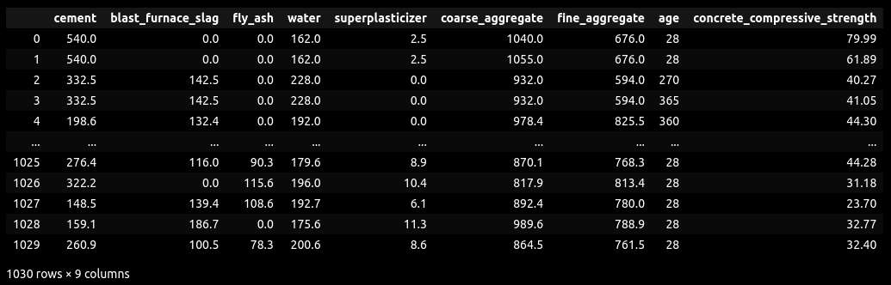

# Artificial Neural Network trained with Particle Swarm Optimisation for compressive strength analysis of concrete

#### Biologically Inspired Computation Coursework

## Group members

1. Antoine ESMAN - @Arcod7 - H
2. Arne JACOBS - @ArneMinem - H00508832

## Description

This project is our coursework for the Biologically Inspired Computation module of our MSc Robotics at Heriot-Watt University.
The aim of this project is to implement an Artificial Neural Network (ANN) trained with Particle Swarm Optimisation (PSO) to predict the compressive strength of concrete based on its ingredients and age.

## Table of Contents

## 1. Running the code

### 1.1 Installation venv

`python3 -m venv .venv`

### 1.2 Troubleshooting

`sudo apt install python3.10-venv`

### 1.3 Activation venv

`source .venv/bin/activate`

## 2. Project structure

- `data/` : contains the dataset
- `documentation/` : contains the project documentation
- `src/` : contains the source code

### 2.1 Dataset

The dataset used in this project is the "Concrete Compressive Strength Data Set" from the UCI Machine Learning Repository. It contains 1030 instances with 8 features and 1 target variable (compressive strength).

### 2.2 Documentation

The documentation folder contains the weekly reports and explanations of the project steps. Here are the links to each week's documentation:
- [W6 - Part 1 - Data preprocessing](documentation/W6_1_Data_Preprocessing.md)
- [W6 - Part 2 - MLP implementation](documentation/W6_2_MLP.md)
- [W7 - Part 1 - PSO implementation](documentation/W7_1_PSO.md)
- [W7 - Part 2 - Sequential Model](documentation/W7_2_Sequential.md)
- [W8 - Part 1 - GA implementation](documentation/W8_1_GA.md)
- [W8 - Part 2 - Accuracy implementation](documentation/W8_2_Accuracy.md)
- [W8 - Part 3 - Online training and visualisation](documentation/W8_3_Online_Training_and_Visualisation.md)
- [W9 & 10 - Little changes and tests](documentation/W9_10_Little_Changes_and_Tests.md)

### 2.3 Source code

The source code folder contains the implementation of the ANN, PSO, GA, and other related functionalities. We separated the code into different files for better organization:
<!-- - [text](src/__init__.py) -->
- [Defintion of activation functions](src/activations.py)
- [Load and preprocess the data](src/data.py)
- [Genetic Algorithm for PSO optimisation](src/ga.py)
- [The definition of a Layer](src/layer.py)
- [Defining the basic ANN layer](src/linear.py)
<!-- - [text](src/model_builders.py) -->
- [NOT USED - Running parallel training](src/parallel_eval.py)
- [Particle Swarm Optimiser](src/pso.py)
- [Sequential Model](src/sequential.py)
- [Informants strategy and evaluation metrics](src/utils.py)

In the source code folder there is the streamlit folder which is used for running GA online. Inside we have:
<!-- - [text](src/streamlit/__init__.py)  -->
- [Creation of the Web Interface for training and visualisation](src/streamlit/app.py) 
- [Creation of the database used to store the GA's data when running](src/streamlit/db.py) 
- [Code used to run the GA online](src/streamlit/train_manager.py)

## 3. What we did

### 3.1 Data preprocessing

We simply loaded the data in a DataFrame with Pandas, split it in train and test sets using a random state to ensure we always have the same split.
This is necessary to have comparable results.

### 3.2 The Artificial Neural Network

We created a couple of classes that are used together to make an ANN. There is the Layer class which defines a Layer and is parent of the Linear class corresponding to a hidden layer with nodes. Layer is also parent to the activation function which we defined as layers to enable easy forward steps.

All of them come together by using the Sequential class. We made a Sequential to enable easy topology modification by hand and even topology mutation and crossover later on.

### 3.3 The Particle Swarm Optimiser

We made the PSO to 

## Going further

### Dataset
- [x] make output proportional by dividing by max value of target in training set

### PSO
- [x] change the activation function
- [x] change the topology of the input ANN (number of layers, number of neurons per layer)

### Error evaluation
- [x] implement other error metrics (MSE, RMSE, R2)

### Informants selection
- [x] implement different informants selection strategies (radius-based, **k-nearest neighbors**, random every iteration)

### Sequential Model
- [x] implement Sequential model to have variable number of layers and neurons and activation functions

### Clip velocity and position
- [x] reset position/velocity when out of bounds

### Accuracy
- [x] implement accuracy metric for regression

### Genetic Algorithm
- [x] Limit training with an amount of time instead of epochs
- [x] Don't overtrain, stop training if the loss has not decreased for 20 epochs

### Graphs
- [ ] plot fitness over hyperparameters (number of particles, inertia weight, cognitive and social coefficients, number of informants, topology)
- [ ] plot two hyperparameters to compare them:  eg. plot cognitive over social with point size for fitnesses
