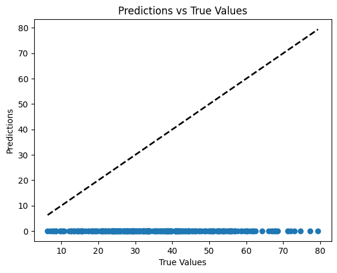
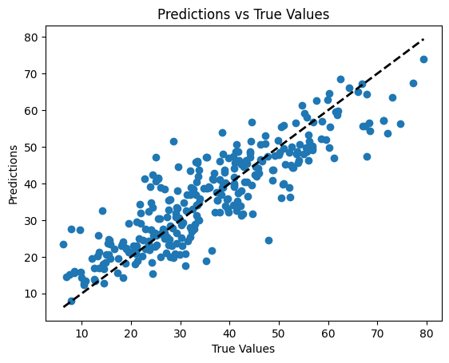

# W7 - Part 2 - Implementation of a Sequential Model

Table of Contents
- [1. Idea](#1-idea)
  - [1.1 Sequential Class](#11-sequential-class)
  - [1.2 Modifications to Layer Classe and addition of different Layer Types](#12-modifications-to-layer-classe-and-addition-of-different-layer-types)
    - [1.2.1 Activation Layers](#121-activation-layers)
    - [1.2.2 Linear Layer](#122-linear-layer)
- [2. Integrating PSO with the Sequential Model](#2-integrating-pso-with-the-sequential-model)
  - [2.1 Loss functions](#21-loss-functions)
  - [2.2 Completed the Particle Class](#22-completed-the-particle-class)
  - [2.3 Updated ParticleSwarmOptimisation Class](#23-updated-particleswarmoptimisation-class)
- [3. Testing the Integration](#3-testing-the-integration)
- [4. Conclusion](#4-conclusion)
- [5. Next Steps](#5-next-steps)

## 1. Idea

In the meanwhile we thought of making a `Sequential` class that would allow us to stack layers in a more flexible way. This class would manage a list of layers and provide methods for adding layers and performing the forward pass through the entire network.

This class would replace the current MLP class structure, allowing for more modular and dynamic construction of neural networks. Each layer could be an instance of a `Layer` class (previously LayerMLP), and the `Sequential` class would handle the connections between these layers. Moreover, this way we could also easily create layers for activation functions such as ReLU, Tanh and Sigmoïd and add them to the sequence.

### 1.1 Sequential Class

The Sequential class is very similar to the MLP class, but instead of hardcoding the layers, we maintain a list of layers that can be dynamically modified. The forward method iterates through each layer in the list and applies the forward pass sequentially.

```
class Sequential:
    def __init__(self, *layers: Layer, randomize: bool = True):
        self.layers = layers
        self.vectorizable_layers: List[Linear] = [layer for layer in self.layers if layer.isVectorizable]
        self.vector_indexes = []
        index = 0
        for layer in self.vectorizable_layers:
            size_layer_params = layer.weights.size + layer.bias.size
            self.vector_indexes.append((index, index + size_layer_params))
            index += size_layer_params

        if randomize:
            self.randomize()

    def randomize(self):
        for layer in self.layers:
            layer.randomize()

    def forward(self, X: np.ndarray) -> np.ndarray:
        output = X
        for layer in self.layers:
            output = layer.forward(output)
        return output

    def to_vector(self) -> np.ndarray:
        """Concatenate parameters from all layers into a single vector."""
        param_vector = np.array([])
        for layer in self.vectorizable_layers:
            param_vector = np.concatenate((param_vector, layer.to_vector()))
        return param_vector

    def from_vector(self, param_vector: np.ndarray):
        """Set parameters from all layers from a single vector."""
        for i in range(len(self.vectorizable_layers)):
            start_idx, end_idx = self.vector_indexes[i]
            self.vectorizable_layers[i].from_vector(param_vector[start_idx:end_idx])
```

### 1.2 Modifications to Layer Classe and addition of different Layer Types

LayerMLP became the base class `Layer` and we created different types of layers that inherit from this base class. Each layer type implements its own forward method and there is also the randomize method for the Linear layer. As we now have layers for activation functions, we removed the sigmoid method from the Layer class.

```
class Layer:
    def __init__(self):
        self.isVectorizable = False

    def forward(self, input_data: np.ndarray) -> np.ndarray:
        raise NotImplementedError("Forward method not implemented.")

    def randomize(self) -> None:
        pass
```

#### 1.2.1 Activation Layers

We implemented activation layers such as Sigmoid, ReLU, and Tanh that inherit from the Layer class. These layers do not have weights or biases, so they do not need to implement the randomize method.

```
class ActivationSigmoid(Layer):
    def forward(self, input_data: np.ndarray) -> np.ndarray:
        return 1 / (1 + np.exp(-input_data))

class ActivationReLU(Layer):
    def forward(self, input_data: np.ndarray) -> np.ndarray:
        return np.maximum(0, input_data)

class ActivationTanh(Layer):
    def forward(self, input_data: np.ndarray) -> np.ndarray:
        return np.tanh(input_data)
```

#### 1.2.2 Linear Layer

This is the Linear layer that contains weights and biases and implements the randomize method as well as the to_vector and from_vector methods for parameter vectorization. This layer is similar to the previous LayerMLP class. It represents a fully connected layer in the neural network.

```
class Linear(Layer):
    def __init__(self, size_input: int, size_hidden: int):
        """Initialize with weights and biases."""
        self.size_input = size_input
        self.size_hidden = size_hidden
        self.weights = self.init_weights()
        self.bias = self.init_biases()
        self.isVectorizable = True

    def init_weights(self):
        """Initialize weights."""
        return np.random.randn(self.size_hidden, self.size_input) * 0.1

    def init_biases(self):
        """Initialize biases."""
        return np.full((self.size_hidden, 1), 0.01)

    def randomize(self):
        """Randomize weights and biases."""
        self.weights = self.init_weights()
        self.bias = self.init_biases()

    def forward(self, X):
        return np.dot(self.weights, X) + self.bias

    def to_vector(self) -> np.ndarray:
        """Flatten weights and biases into a single vector."""
        return np.concatenate((self.weights.flatten(), self.bias.flatten()))

    def from_vector(self, vector: np.ndarray) -> int:
        """Set weights and biases from a single vector."""
        self.weights = vector[:self.weights.size].reshape(self.weights.shape)
        self.bias = vector[self.weights.size:].reshape(self.bias.shape)
```

## 2. Integrating PSO with the Sequential Model

To integrate the Particle Swarm Optimization (PSO) with the new Sequential model, we needed to modify the PSO implementation to work with the Sequential class instead of the MLP class. The main changes involved updating how particles represent their positions and velocities in relation to the Sequential model's parameters.

### 2.1 Loss functions

Wanting to run the PSO with the Sequential model, we had to add loss computation and fitness evaluation methods. We defined mean_squared_error and mean_absolute_error functions to evaluate the performance of the Sequential model during optimization.
```
def mean_squared_error(y_true: np.ndarray, y_pred: np.ndarray) -> float:
    return np.mean((y_true - y_pred) ** 2)

def mean_absolute_error(y_true: np.ndarray, y_pred: np.ndarray) -> float:
    return np.mean(np.abs(y_true - y_pred))
```

### 2.2 Completed the Particle Class

We completed the Particle class by adding methods to get the best informant and update the velocity and position of the particles based on the PSO algorithm. The particles now interact with the Sequential model to evaluate fitness and update their positions in the search space.

```
class Particle:
    def __init__(self, position: np.ndarray, accel_coeff: AccelerationCoefficients, fitness: float):
        self.accel_coeff = accel_coeff
        # Initialize other attributes like position, velocity, personal best, etc.
        self.position = position
        self.velocity = np.random.randn(position.shape[0]) * 0.1
        self.fittest = fitness
        self.informants: List[Particle] = []

        self.best_personal: np.ndarray = position.copy()

    def get_best_informant(self):
        informant_fittest = None
        best_informant = None
        for informant in self.informants:
            if best_informant is None or informant.fittest < informant_fittest:
                informant_fittest = informant.fittest
                best_informant = informant
        return best_informant.position

    def update_velocity(self, best_global):
        best_informant = self.get_best_informant()
        for i in range(len(self.position)):
            b = np.random.random() * self.accel_coeff.cognitive_weight
            c = np.random.random() * self.accel_coeff.social_weight
            d = np.random.random() * self.accel_coeff.global_best_weight
            inertia = self.accel_coeff.inertia_weight * self.velocity[i]
            velocity_cognitive = b * (self.best_personal[i] - self.position[i])
            velocity_social = c * (best_informant[i] - self.position[i])
            velocity_global = d * (best_global[i] - self.position[i])
            new_velocity = inertia + velocity_cognitive + velocity_social + velocity_global
            self.velocity[i] = np.clip(new_velocity, -self.accel_coeff.max_velocity, self.accel_coeff.max_velocity)

    def update_position(self):
        self.position += self.velocity * self.accel_coeff.jump_size
        self.position = np.clip(self.position, -self.accel_coeff.max_position, self.accel_coeff.max_position)
```

- `get_best_informant`: This method iterates through the particle's informants to find and return the position of the informant with the best fitness.
- `update_velocity`: This method updates the particle's velocity based on its own best position, the best position among its informants, and the global best position found by the swarm. The velocity is influenced by cognitive, social, and global components, each scaled by random factors and acceleration coefficients.
- `update_position`: This method updates the particle's position based on its current velocity and a jump size factor. The new position is clipped to ensure it stays within defined bounds and avoid explosion.

### 2.3 Updated ParticleSwarmOptimisation Class

Finally, we updated the ParticleSwarmOptimisation class. 

```
class ParticleSwarmOptimisation:
    def __init__(
            self,
            X: np.ndarray[tuple[int, int]],
            Y: np.ndarray[tuple[int]],
            swarm_size: int,
            epochs: int,
            accel_coeff: AccelerationCoefficients,
            num_informants: int,
            loss_function,
            model: Sequential,
        ):
        self.epochs = epochs
        self.accel_coeff = accel_coeff
        self.swarm_size = swarm_size
        self.num_informants = num_informants

        self.X = X
        self.Y = Y

        self.loss_function = loss_function
        self.model = model

        self.population: List[Particle] = []
        for _ in range(swarm_size):
            self.model.randomize()
            particle_fitness = self.loss_function(self.Y, self.model.forward(self.X))
            self.population.append(Particle(position=self.model.to_vector(), accel_coeff=accel_coeff, fitness=particle_fitness))

        self.best_global: np.ndarray = self.population[0].position.copy()
        self.best_global_fitness: float = self.population[0].fittest
```
We added the presence of a loss function and set the best global position and fitness equals to the first particle's position and fitness at initialisation.

```
    def update_informants(self):
        if self.num_informants >= self.swarm_size:
            raise ValueError("Number of informants must be less than swarm size.")
        for particle in self.population:
            others = [p for p in self.population if p is not particle]
            particle.informants = np.random.choice(others, size=self.num_informants, replace=False)
```
We improved the `update_informants` adding a condition to avoid self-informants and ensure there are less informants than particles.

```
    def update_best_global(self, epoch):
        loss = 0.0
        for particle in self.population:
            self.model.from_vector(particle.position)
            # if loss == 0.0:
            #     print(f"Particle position sample: {particle.position[:5]}")
            fitness = self.loss_function(self.Y, self.model.forward(self.X))
            loss += fitness
            # print(f"Particle fitness: {fitness}")
            if fitness < particle.fittest:
                particle.best_personal = particle.position.copy()
                particle.fittest = fitness
                if self.best_global_fitness is None or fitness < self.best_global_fitness:
                    # print(f"{epoch}: New best found: {fitness}")
                    self.best_global = particle.position.copy()
                    self.best_global_fitness = fitness
        return loss / self.swarm_size
```
We completed the `update_best_global` method to evaluate each particle's fitness using the provided loss function and update the personal and global bests accordingly.

```
    def update_velocities(self):
        for particle in self.population:
            particle.update_velocity(self.best_global)

    def update_positions(self):
        for particle in self.population:
            particle.update_position()

    def train(self):
        self.update_informants()
        losses = []
        for epoch in range(self.epochs):
            loss = self.update_best_global(epoch)
            losses.append(loss)
            self.update_velocities()
            self.update_positions()
            # print(f"Epoch {epoch}, Loss: {loss}")
        return (self.best_global, self.best_global_fitness, losses)
```
We completed the train method to run the PSO over the specified number of epochs, updating informants, evaluating fitness, and updating velocities and positions of particles in each iteration. The method returns the best global position, its fitness, and the loss history over epochs.

## 3. Testing the Integration

To test the integration of the Sequential model with the Particle Swarm Optimization (PSO) algorithm, we defined a sequential model with multiple layers, including Linear and ReLU activation layers. We then created a PSO instance to optimize the parameters of this model using mean squared error as the loss function.

```
mlp = Sequential(
    Linear(size_input=train_features.shape[1], size_hidden=10),
    ActivationReLU(),
    Linear(size_input=10, size_hidden=10),
    ActivationReLU(),
    Linear(size_input=10, size_hidden=10),
    ActivationReLU(),
    Linear(size_input=10, size_hidden=1),
)

predictions = mlp.forward(test_features.T)

plt.scatter(test_targets, predictions)
plt.xlabel("True Values")
plt.ylabel("Predictions")
plt.title("Predictions vs True Values")
plt.plot([test_targets.min(), test_targets.max()], [test_targets.min(), test_targets.max()], 'k--', lw=2)
plt.show()

pso = ParticleSwarmOptimisation(
    X=train_features.T,
    Y=train_targets,
    swarm_size=100,
    epochs=1000,
    accel_coeff=AccelerationCoefficients(
        inertia_weight=0.5,
        cognitive_weight=1.5,
        social_weight=1.5,
        global_best_weight=0.5,
        jump_size=0.1,
        max_velocity=0.01,
        max_position=5.0,
    ),
    num_informants=5,
    loss_function=mean_squared_error,
    model=mlp
)

(final_position, final_score, losses) = pso.train()
print(f"Final particle fitness: {final_score}")
print(f"Final particle position sample: {final_position[:5]}")

mlp.from_vector(final_position)
predictions = mlp.forward(test_features.T)

plt.scatter(test_targets, predictions)
plt.xlabel("True Values")
plt.ylabel("Predictions")
plt.title("Predictions vs True Values")
plt.plot([test_targets.min(), test_targets.max()], [test_targets.min(), test_targets.max()], 'k--', lw=2)
plt.show()

plt.plot(losses)
plt.yscale("log")
plt.xlabel("Epoch")
plt.ylabel("Loss")
plt.title("Training Loss over Epochs")
plt.show()

print("Final loss", losses[-1])
```

The code ran smoothly and gave us our first results using the Sequential model with PSO.

At first, we had an exploding Loss going to infinity. We spent a lot of time trying to figure out the cause of this issue. We checked all the signs in the code to be sure everything was coherent and didn't see any problem. After playing around with different hyperparameters, we realised that we weren't constraining enough the particles' velocities and positions and we forgot to use jump_size. By adding a maximum velocity and maximum position in the AccelerationCoefficients and clipping the values in the Particle class, we managed to stabilise the training process and have a decreasing loss.

We think that the origin of the problem was that some particles were going too far in the search space and producing NaN values during the forward pass, which then propagated through the loss computation and caused the exploding loss.

After some tuning we ended up with hyperparameters that gave us a stable training process and decent results.

We have a graph representing the predictions vs the true values before training:



We notice that all predictions are clustered around 0. This is expected since we initialise the weights close to 0.

After training, we obtained the following graph:



We can see that the predictions are now much closer to the true values, indicating that the model has learned from the training data.

Finally, we have the training loss over epochs:


As you can see, the loss decreases over time, which is a good sign that the PSO algorithm is effectively optimizing the model's parameters.This confirms that our implementation of the Sequential model and its integration with the PSO algorithm is functioning correctly. However, there is still room for improvement in terms of model architecture, hyperparameter tuning, and optimization strategies to achieve better performance. Indeed, after reaching a loss of around 100, the loss started to get unstable and oscillate a bit.

The final particle fitness we obtained was around 60.32 which we can't really describe yet since we don't have a baseline to compare it to. But overall, we are satisfied with the results of this first integration of the Sequential model with PSO.

## 4. Conclusion

In this part, we successfully implemented a Sequential model that allows for flexible stacking of layers and integrated it with the Particle Swarm Optimization algorithm. We defined various layer types, including Linear and activation layers, and modified the PSO implementation to work with the new model structure. The testing phase demonstrated that the Sequential model could effectively learn from data using PSO, as evidenced by the improved predictions and reduced loss over epochs. This implementation provides a solid foundation for further experimentation and optimization of neural network architectures using PSO. Future work could involve exploring different layer configurations, activation functions, and hyperparameter settings to enhance model performance.

## 5. Next Steps

We started thinking about adding a Genetic Algrorithm to our project. Indeed, we need to test different hyperparameters to understand their impact on the training process and final performance. A Genetic Algorithm could help us explore a wide range of hyperparameter combinations efficiently. We could define a population of hyperparameter sets, evaluate their performance using the Sequential model and PSO, and then use genetic operations like selection, crossover, and mutation to evolve the population over generations. This approach would allow us to identify optimal or near-optimal hyperparameter configurations that lead to better model performance.

The idea would then be to analyse these results to understand which hyperparameters have the most significant impact on the training process and final performance and why.

We also started writing in the README.md the potential things we could add to the project in the future. This way we won't forget any ideas and we can prioritise them later.