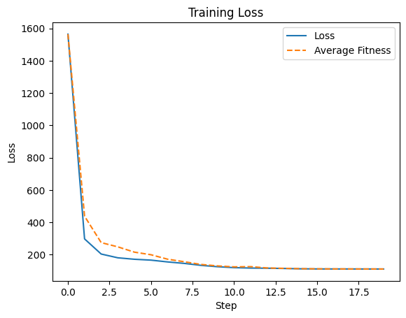
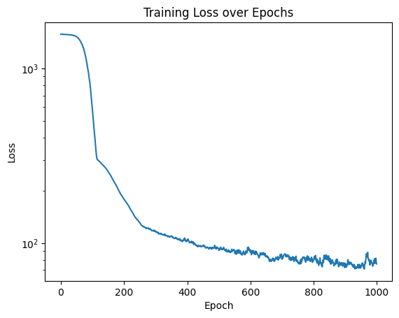
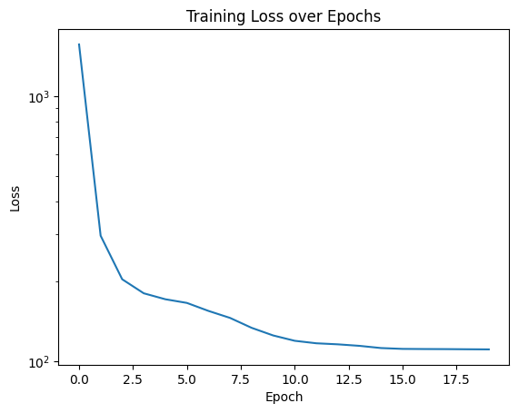

# W8 - Part 1 - Genetic Algorithm Integration

Table of Contents

- [1. Integration of Genetic Algorithm (GA)](#1-integration-of-genetic-algorithm-ga)
    - [1.1 Initial Code Snippet](#11-initial-code-snippet)
    - [1.2 ChatGPT's Output](#12-chatgpts-output)
    - [1.3 Final Implementation](#13-final-implementation)
        - [1.3.1 AccelerationCoefficientsGenome](#131-accelerationcoefficientsgenome)
        - [1.3.2 PsoGenome](#132-psogenome)
        - [1.3.3 PsoEvaluator](#133-psoevaluator)
        - [1.3.4 GeneticIndividual](#134-geneticindividual)
        - [1.3.5 GeneticPsoOptimizer](#135-geneticpsooptimizer)
- [2. Add Plot function to test GA's results](#2-add-plot-function-to-test-gas-results)
- [3. Conclusion](#3-conclusion)
- [4. Next Steps](#4-next-steps)


## 1. Integration of Genetic Algorithm (GA)

We integrated a Genetic Algorithm (GA) into our framework to optimize the hyperparameters of our PSO. As there are many hyperparameters to tune in PSO, we decided to use GA to find the best combination of these parameters automatically. Indeed, manually tuning PSO hyperparameters can be time-consuming and may not yield the best results. With the variety of parameters the optimisation seemed to be of a dimension bigger than what we could handle manually. Modifying one hyperparameter can affect the performance of others, making it challenging to find the optimal set through trial and error.

As the GA was more of a means to an end rather than the main focus of our project, we used ChatGPT to give us the basic structure based on our requirements. We then modified and expanded the code to fit our specific needs and integrate it with our existing PSO implementation.

### 1.1 Initial Code Snippet

This was the snippet of code we gave to ChatGPT to get started:

```
# @dataclass
# class PsoGenome:
#     swarm_size: int
#     accel_coeff: AccelerationCoefficients
#     num_informants: int
#     particle_initial_position_scale: Tuple[float, float]
#     loss_function: callable

#     def crossovers(self, other: 'PsoGenome') -> 'PsoGenome':
#         # Implement crossover logic
#         pass

# class GeneticIndividual:
#     def __init__(self, genome: np.ndarray):
#         self.genome = genome
#         self.fitness: float = float('inf')

# class GeneticPsoOptimizer:
#     def __init__(self, population_size: int, mutation_rate: float, crossover_rate: float, model: Sequential, loss_function):
#         self.population_size = population_size
#         self.mutation_rate = mutation_rate
#         self.crossover_rate = crossover_rate
#         self.loss_function = loss_function
#         self.population: List[GeneticIndividual] = []
#         self.fitnesses: List[float] = [self.evaluate_fitness(individual) for individual in self.population]

#     def evaluate_fitness(self, individual: ParticleSwarmOptimisation) -> float:
#         pass
```

The idea we had was to create three main classes:

1. `PsoGenome`: This class represents the genome of a PSO particle, containing all the hyperparameters to be optimized.
2. `GeneticIndividual`: This class represents an individual in the genetic algorithm population, containing a genome and its fitness value.
3. `GeneticPsoOptimizer`: This class implements the genetic algorithm to optimize the PSO hyperparameters.

### 1.2 ChatGPT's Output

After providing the initial code snippet, ChatGPT generated a more complete implementation of the Genetic Algorithm for optimizing PSO hyperparameters. The output included methods for crossover, mutation, and fitness evaluation, as well as the main loop for running the genetic algorithm.

The code wasn't running perfectly at first, so we had to debug and modify several parts to ensure it worked correctly with our existing PSO implementation. This involved adjusting the fitness evaluation method to properly assess the performance of the PSO with the given hyperparameters and ensuring that the crossover and mutation methods produced valid genomes.

### 1.3 Final Implementation

At the end we ended with the following code for the Genetic Algorithm integration:

```
from __future__ import annotations
import time
import copy
import random
import math
from dataclasses import dataclass, field
from typing import Tuple, List, Optional, Callable, Any, Dict
import numpy as np
import multiprocessing as mp

# --- Genome definition -----------------------------------------------------

@dataclass
class AccelerationCoefficientsGenome:
    inertia_weight: float
    cognitive_weight: float
    social_weight: float
    global_best_weight: float
    jump_size: float
    max_velocity: float
    max_position: float

    def mutate(self, mutation_rate: float, ranges: Dict[str, Tuple[float, float]]):
        # gaussian perturbation per field with chance
        for name in vars(self):
            if random.random() < mutation_rate:
                lo, hi = ranges[name]
                cur = getattr(self, name)
                # relative gaussian step
                step = (hi - lo) * 0.1
                new = cur + random.gauss(0, step)
                setattr(self, name, float(np.clip(new, lo, hi)))

    @staticmethod
    def crossover(a: 'AccelerationCoefficientsGenome', b: 'AccelerationCoefficientsGenome') -> 'AccelerationCoefficientsGenome':
        # uniform crossover
        out = {}
        for name in vars(a):
            out[name] = getattr(a, name) if random.random() < 0.5 else getattr(b, name)
        return AccelerationCoefficientsGenome(**out)

@dataclass
class PsoGenome:
    swarm_size: int
    accel: AccelerationCoefficientsGenome
    num_informants: int
    particle_initial_position_scale: Tuple[float, float]
    # optionally include model architecture: list of hidden layer sizes and activation names
    ann_layers: Optional[Tuple[int, ...]] = None
    ann_activation: str = "tanh"
    # keep a pointer/identifier to the loss function if desired (not serializable)
    # loss_function: Callable = field(default=None, repr=False)

    def copy(self) -> 'PsoGenome':
        return copy.deepcopy(self)

    def mutate(self, mutation_rate: float, bounds: dict):
        # mutate swarm size (discrete), num_informants (discrete), scales and accel
        if random.random() < mutation_rate:
            self.swarm_size = int(np.clip(self.swarm_size + random.randint(-4, 4), bounds['swarm_size'][0], bounds['swarm_size'][1]))
        if random.random() < mutation_rate:
            self.num_informants = int(np.clip(self.num_informants + random.randint(-2, 2), 1, max(1, self.swarm_size - 1)))
        if random.random() < mutation_rate:
            s0, s1 = self.particle_initial_position_scale
            s0 += random.gauss(0, (bounds['position_scale'][1] - bounds['position_scale'][0]) * 0.05)
            s1 += random.gauss(0, (bounds['bias_scale'][1] - bounds['bias_scale'][0]) * 0.05)
            self.particle_initial_position_scale = (float(np.clip(s0, bounds['position_scale'][0], bounds['position_scale'][1])),
                                                   float(np.clip(s1, bounds['bias_scale'][0], bounds['bias_scale'][1])))
        # mutate acceleration coeffs
        self.accel.mutate(mutation_rate, bounds['accel_ranges'])
        # mutate architecture (small chance)
        if self.ann_layers is not None and random.random() < mutation_rate:
            layers = list(self.ann_layers)
            if random.random() < 0.5 and len(layers) > 0:
                # tweak a layer size
                idx = random.randrange(len(layers))
                layers[idx] = int(np.clip(layers[idx] + random.randint(-8, 8), 1, 1024))
            else:
                # either add or remove layer
                if random.random() < 0.5 and len(layers) > 1:
                    layers.pop(random.randrange(len(layers)))
                else:
                    # add a small layer
                    insert_at = random.randrange(len(layers)+1)
                    layers.insert(insert_at, random.randint(1, 32))
            self.ann_layers = tuple(layers)

    @staticmethod
    def crossover(a: 'PsoGenome', b: 'PsoGenome', crossover_rate: float = 0.5) -> 'PsoGenome':
        # single-point for architecture, uniform for many numeric
        child = a.copy()
        # swarm size: average with some chance
        child.swarm_size = int((a.swarm_size if random.random() < 0.5 else b.swarm_size))
        child.num_informants = int((a.num_informants if random.random() < 0.5 else b.num_informants))
        child.particle_initial_position_scale = (a.particle_initial_position_scale if random.random() < 0.5 else b.particle_initial_position_scale)
        child.accel = AccelerationCoefficientsGenome.crossover(a.accel, b.accel)
        # architecture crossover (if both defined)
        if a.ann_layers and b.ann_layers:
            if random.random() < crossover_rate:
                # one-point crossover on layer lists
                la, lb = list(a.ann_layers), list(b.ann_layers)
                cut_a = random.randrange(len(la))
                cut_b = random.randrange(len(lb))
                new_layers = tuple(la[:cut_a] + lb[cut_b:])
                child.ann_layers = new_layers
        else:
            child.ann_layers = a.ann_layers or b.ann_layers
        return child

# --- Evaluator -------------------------------------------------------------

class PsoEvaluator:
    def __init__(
        self,
        X: np.ndarray,
        Y: np.ndarray,
        base_model_builder: Callable[[PsoGenome], Any],
        loss_function: Callable[[np.ndarray, np.ndarray], float],
        max_train_seconds: float = 10.0,
        patience_window: int = 20,
        explosion_factor: float = 1e6,
        verbose: bool = False
    ):
        """
        base_model_builder: function(genome)->model where model implements the interface expected by ParticleSwarmOptimisation:
            - randomize(weight_scale, bias_scale)
            - to_vector()/from_vector()
            - forward(X)
        """
        self.X = X
        self.Y = Y
        self.base_model_builder = base_model_builder
        self.loss_function = loss_function
        self.max_train_seconds = max_train_seconds
        self.patience_window = patience_window
        self.explosion_factor = explosion_factor
        self.verbose = verbose

    def evaluate(self, genome: PsoGenome) -> float:
        """
        Returns scalar fitness. Lower is better.
        Implements:
         - time-limited training
         - early stopping on recent-window no-improvement (penalise)
         - explosion detection (penalise)
        """
        # build model
        model = self.base_model_builder(genome)

        # build PSO with the genome's params
        accel = genome.accel
        accel_obj = AccelerationCoefficients(
            inertia_weight=accel.inertia_weight,
            cognitive_weight=accel.cognitive_weight,
            social_weight=accel.social_weight,
            global_best_weight=accel.global_best_weight,
            jump_size=accel.jump_size,
            max_velocity=accel.max_velocity,
            max_position=accel.max_position
        )

        pso = ParticleSwarmOptimisation(
            X=self.X, Y=self.Y,
            swarm_size=genome.swarm_size,
            epochs=1000000,  # huge number -- we will stop by time
            accel_coeff=accel_obj,
            num_informants=max(1, min(genome.num_informants, genome.swarm_size - 1)),
            loss_function=self.loss_function,
            particle_initial_position_scale=genome.particle_initial_position_scale,
            model=model
        )

        start_time = time.time()
        last_losses = []
        best_history = []
        try:
            # replace PSO.train loop with a time-aware training
            pso.update_informants()
            epoch = 0
            best_global_fitness = pso.best_global_fitness
            # compute an initial loss to detect explosion (if available)
            # We'll compute first fitness properly
            avg = pso.update_best_global(0)
            initial_loss = max(1e-12, pso.best_global_fitness or avg or 1.0)
            # if self.verbose:
            #     print(f"[eval] initial loss {initial_loss:.6g}")
            while True:
                # check time limit
                if time.time() - start_time > self.max_train_seconds:
                    break
                # iterate a small PSO step: velocities, positions, recompute bests
                pso.update_velocities()
                pso.update_positions()
                avg_fitness = pso.update_best_global(epoch)
                best_history.append(pso.best_global_fitness)
                last_losses.append(pso.best_global_fitness)
                # explosion detection
                if pso.best_global_fitness > initial_loss * self.explosion_factor:
                    # heavy penalty
                    if self.verbose:
                        print("[eval] explosion detected. stopping early.")
                    return float('inf')
                # early stopping: check last window
                if len(last_losses) > self.patience_window:
                    # consider improvement if best decreased at least once in window
                    window = last_losses[-self.patience_window:]
                    if min(window) >= window[0]:  # no improvement
                        # penalize slightly, but still return current best
                        penalty = 1.0 + 0.1 * math.log(1 + epoch)
                        if self.verbose:
                            print(f"[eval] early stopping at epoch {epoch} with penalty {penalty:.6g}")
                        return pso.best_global_fitness * penalty
                epoch += 1
            # normal return: the best found
            if self.verbose:
                print(f"[eval] completed training epochs: {epoch}, best fitness: {pso.best_global_fitness:.6g}")
            return pso.best_global_fitness
        except Exception as e:
            # crash in training -> penalize heavily
            if self.verbose:
                print("[eval] Exception during PSO eval:", e)
            return float('inf')

# --- Genetic algorithm ----------------------------------------------------

@dataclass
class GeneticIndividual:
    genome: PsoGenome
    fitness: float = float('inf')

class GeneticPsoOptimizer:
    def __init__(
        self,
        evaluator: PsoEvaluator,
        population_size: int = 20,
        generations: int = 30,
        mutation_rate: float = 0.1,
        crossover_rate: float = 0.8,
        elitism: int = 2,
        tournament_k: int = 3,
        parallel: bool = True,
    ):
        self.evaluator = evaluator
        self.population_size = population_size
        self.generations = generations
        self.mutation_rate = mutation_rate
        self.crossover_rate = crossover_rate
        self.elitism = elitism
        self.tournament_k = tournament_k
        self.parallel = parallel
        self.population: List[GeneticIndividual] = []

    def initialize(self, seed_genome_factory: Callable[[], PsoGenome]):
        self.population = [GeneticIndividual(seed_genome_factory()) for _ in range(self.population_size)]

    def evaluate_population(self):
        # Evaluate all individuals (optionally in parallel)
        if self.parallel:
            with mp.Pool(max(1, mp.cpu_count() - 1)) as pool:
                genomes = [ind.genome for ind in self.population]
                results = pool.map(self.evaluator.evaluate, genomes)
            for ind, f in zip(self.population, results):
                ind.fitness = f
        else:
            for ind in self.population:
                ind.fitness = self.evaluator.evaluate(ind.genome)

    def tournament_select(self) -> PsoGenome:
        contenders = random.sample(self.population, self.tournament_k)
        best = min(contenders, key=lambda ind: ind.fitness)
        return best.genome.copy()

    def step(self):
        # create next generation
        new_pop: List[GeneticIndividual] = []
        # elitism: carry best individuals
        sorted_pop = sorted(self.population, key=lambda ind: ind.fitness)
        for i in range(self.elitism):
            new_pop.append(GeneticIndividual(sorted_pop[i].genome.copy(), sorted_pop[i].fitness))
        # fill rest
        while len(new_pop) < self.population_size:
            parent_a = self.tournament_select()
            if random.random() < self.crossover_rate:
                parent_b = self.tournament_select()
                child_genome = PsoGenome.crossover(parent_a, parent_b, crossover_rate=self.crossover_rate)
            else:
                child_genome = parent_a.copy()
            child_genome.mutate(self.mutation_rate, bounds=self._bounds())
            new_pop.append(GeneticIndividual(child_genome))
        self.population = new_pop

    def run(self, seed_genome_factory: Callable[[], PsoGenome], verbose: bool = True):
        self.initialize(seed_genome_factory)
        self.evaluate_population()
        best_history = []
        for g in range(self.generations):
            if verbose:
                best = min(self.population, key=lambda ind: ind.fitness)
                avg_fitness = sum(ind.fitness for ind in self.population) / len(self.population)
                print(f"[GA] gen {g:02d} best {best.fitness:.6g} avg {avg_fitness:.6g}")
                with open("ga_pso_log.csv", "a") as f:
                    f.write(f"{g},{best.fitness},{avg_fitness}\n")
            self.step()
            self.evaluate_population()
            best_history.append(min(self.population, key=lambda ind: ind.fitness).fitness)
        # final best
        best_ind = min(self.population, key=lambda ind: ind.fitness)
        return best_ind, best_history

    def _bounds(self):
        # central place for bounds used by mutate: feel free to expose
        return {
            'swarm_size': (4, 200),
            'position_scale': (1e-4, 1.0),
            'bias_scale': (1e-6, 1.0),
            'accel_ranges': {
                'inertia_weight': (0.0, 1.2),
                'cognitive_weight': (0.0, 4.0),
                'social_weight': (0.0, 4.0),
                'global_best_weight': (0.0, 4.0),
                'jump_size': (1e-4, 2.0),
                'max_velocity': (1e-6, 10.0),
                'max_position': (1e-3, 100.0),
            }
        }
```

We have 5 classes in total:
1. `AccelerationCoefficientsGenome`: Represents the acceleration coefficients of the PSO as a genome, with methods for mutation and crossover.
2. `PsoGenome`: Represents the entire PSO hyperparameter set as a genome, with methods for mutation and crossover.
3. `PsoEvaluator`: Evaluates a given `PsoGenome` by training a PSO with those hyperparameters and returning a fitness score.
4. `GeneticIndividual`: Represents an individual in the genetic algorithm population, containing a `PsoGenome` and its fitness value.
5. `GeneticPsoOptimizer`: Implements the genetic algorithm to optimize PSO hyperparameters using the `PsoEvaluator`.

#### 1.3.1 AccelerationCoefficientsGenome

This class is basically a copy of the AccelerationCoefficients dataclass from PSO, but with added methods for mutation and crossover. The mutation method applies Gaussian perturbations to each coefficient with a certain probability, while the crossover method performs uniform crossover between two genomes.

`def mutate(self, mutation_rate: float, ranges: Dict[str, Tuple[float, float]]):` takes a mutation rate and a dictionary of ranges for each coefficient. For each coefficient, if a random number is less than the mutation rate, it perturbs the coefficient by adding a Gaussian random value scaled to 10% of the coefficient's range, and then clips it to stay within the specified bounds.

`@staticmethod def crossover(a: 'AccelerationCoefficientsGenome', b: 'AccelerationCoefficientsGenome') -> 'AccelerationCoefficientsGenome':` performs uniform crossover between two genomes. For each coefficient, it randomly selects the value from either parent genome with equal probability, creating a new genome that combines traits from both parents. The @staticmethod decorator indicates that this method does not depend on the instance of the class. This allows us to call the method directly on the class itself, rather than on an instance of the class.

#### 1.3.2 PsoGenome

This class represents the entire PSO hyperparameter set as a genome, including swarm size, number of informants, initial position scale, acceleration coefficients, and optionally ANN architecture parameters. It also has methods for mutation and crossover. We use deep copy to ensure that mutations do not affect the original genome.

`def mutate(self, mutation_rate: float, bounds: dict):` mutates various hyperparameters of the PSO genome. It randomly perturbs the swarm size and number of informants by adding or subtracting small integers, and adjusts the initial position scale using Gaussian noise. It also calls the `mutate` method of the `AccelerationCoefficientsGenome` to mutate the acceleration coefficients. If ANN layers are defined, it may also modify the architecture by tweaking layer sizes or adding/removing layers.

`@staticmethod def crossover(a: 'PsoGenome', b: 'PsoGenome', crossover_rate: float = 0.5) -> 'PsoGenome':` performs a crossover between two genomes by cutting each genome at a random point and concatenating the left part of one genome with the right part of the other. This creates a new genome that combines traits from both parents.

#### 1.3.3 PsoEvaluator

This class evaluates a given `PsoGenome` by training a PSO with those hyperparameters and returning a fitness score. It implements time-limited training, early stopping based on recent performance, and explosion detection to penalize unstable configurations. We chose to implement time-limited training as we thought it is best for us to decide how long to train each PSO instance rather than setting a fixed number of epochs. This allows us to adaptively allocate training time based on the complexity of the problem and the performance of the PSO. The early stopping is used through a patience window to avoid wasting time on configurations that are not improving by penalizing them slightly when they do not show improvement over a set number of epochs. Explosion detection is implemented to penalize configurations that lead to unstable behavior, ensuring that the GA focuses on more stable and effective hyperparameter sets.

#### 1.3.4 GeneticIndividual

This class represents an individual in the genetic algorithm population, containing a `PsoGenome` and its fitness value. It is a simple data container used to store the genome and its associated fitness score.

#### 1.3.5 GeneticPsoOptimizer

This class implements the genetic algorithm for optimizing PSO hyperparameters. It manages the population of `GeneticIndividual` instances, applies selection, crossover, and mutation operations, and maintains the overall optimization process.

`Seed_genome_factory: Callable[[], PsoGenome]` is a function that generates a random `PsoGenome` to initialize the population. This allows for flexibility in defining how the initial genomes are created, enabling us to customize the starting point of the genetic algorithm based on our specific requirements.

For the evaluation of the population, we decided to use multiprocessing to parallelize the fitness evaluations. This idea was mainly for speed, as evaluating each genome involves training a PSO instance, which can be time-consuming. By using multiple CPU cores, we can significantly reduce the overall evaluation time for the population. However, in the end we never really used it. Indeed, in the second part of week 8 we decided on making the GA run online day and night, so speed was not a big concern. Also, for debugging purposes, it was easier to have a single-threaded execution online.

We implemented tournament selection for parent selection. In this method, a subset of individuals is randomly chosen from the population, and the best individual from this subset is selected as a parent. This approach helps maintain diversity in the population while still favoring fitter individuals.

We also included elitism in the genetic algorithm. This means that a certain number of the best individuals from the current generation are carried over unchanged to the next generation. This helps preserve high-quality solutions and ensures that the best-found configurations are not lost during the evolutionary process.

Finally, we had bounds defined in a central place for mutation. This allows us to easily adjust the ranges for each hyperparameter being mutated, ensuring that the mutations produce valid and reasonable values.

## 2. Add Plot function to test GA's results

To visualize the performance of the GA-optimized PSO, we added a plotting function that generates __Loss__ and __Average Fitness__ curves over the course of the optimization process. This allows us to easily assess how well the genetic algorithm is performing and whether it is effectively improving the PSO hyperparameters. __Loss__ is actually the best fitness found in each generation, while __Average Fitness__ is the mean fitness of the population in each generation.

In order to implement this we had to add tiny modifications in our `ParticleSwarmOptimisation` class to keep track of the best fitness history during training. The gathered data is then used to generate the plots thanks to the following method:

```
    def plot(self, epoch, avg_fitness):
        if epoch % 10 == 0:
            self.avg_fitnesses.append(avg_fitness)
            self.losses.append(self.best_global_fitness)
            fig, ax = plt.subplots()
            ax.plot(self.losses, label="Loss")
            ax.plot(
                self.avg_fitnesses,
                label="Average Fitness",
                linestyle="--"
            )
            ax.set_xlabel("Step")
            ax.set_ylabel("Loss")
            ax.set_title("Training Loss")
            ax.legend()

            clear_output(wait=True)
            display(fig)
            plt.close(fig)
```

The GA optimizer gives us the best genome found after running for a specified number of generations. We can then instantiate a PSO with this genome and train it on our dataset. During training, we call the `plot` method at regular intervals to update the loss and average fitness curves. These are the results of our first GA optimised PSO on the concrete compressive strength dataset:



We notice that the loss decreases over time, indicating that the PSO is effectively learning and improving its performance on the dataset. The average fitness also shows a downward trend, suggesting that the overall population is becoming more fit as the training progresses. This visualization helps us confirm that the GA-optimized PSO is functioning as intended and provides insights into its learning dynamics.

The final Loss was 111 which was superior to the one we obtained manually tuning the PSO hyperparameters (around 60). You can compare them in the following graphs:




We observe that indeed the new loss is worse however the training process seems more stable with less fluctuations in the loss curve. More importantly, the new loss was obtained in only 15 epochs while the previous one took more than 800 epochs to reach a better loss. At the 15th epoch of the previous training the loss didn't even start decreasing properly yet. This shows that the GA was able to find hyperparameters that allow the PSO to learn much faster, even if the final performance is not as good as our manually tuned version.

The reason for a very fast but less accurate training is related to the fact that we limited the training time for each PSO evaluation to 1 seconds. This means that the GA was optimising hyperparameters that lead to quick improvements in a short time frame, rather than long-term performance. In future work, we could consider increasing the training time limit during evaluation to allow the GA to find hyperparameters that yield better final performance, even if they take longer to train.

## 3. Conclusion

In this part of the project, we successfully integrated a Genetic Algorithm (based on ChatGPT's output)to optimize the hyperparameters of our Particle Swarm Optimisation framework. By leveraging the power of evolutionary algorithms, we were able to automatically search for effective configurations that enhance the performance of PSO on our dataset.

The GA-optimized PSO demonstrated a stable training process and achieved reasonable performance in a significantly reduced number of epochs compared to our manually tuned version. This highlights the potential of using genetic algorithms for hyperparameter optimization in complex optimization problems.

## 4. Next Steps

Moving forward, we plan to further refine and enhance our Genetic Algorithm implementation by running it over extended periods using online resources. This will allow us to explore a wider range of hyperparameter combinations and potentially discover configurations that yield even better performance. Additionally, we aim to analyze the results obtained from the GA-optimized PSO to gain insights into which hyperparameters have the most significant impact on the training process and final performance. Understanding these relationships will help us make informed decisions when designing and tuning PSO models in the future.