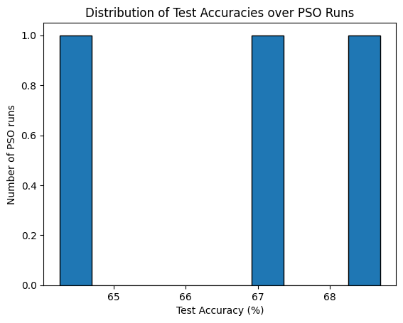

# W8 - Part 2 - Accuracy

Table of Contents

- [1. Previously](#1-previously)
- [2. What is missing?](#2-what-is-missing)
- [3. Accuracy Metric](#3-accuracy-metric)
    - [3.1 Accuracy distribution](#31-accuracy-distribution)
    - [3.2 Averaging over multiple runs](#32-averaging-over-multiple-runs)
    - [3.3 Performance considerations](#33-performance-considerations)
- [4. Next Steps](#4-next-steps)

## 1. Previously

We have a functioning neural network, with a working PSO algorithm and a Genetic Algorithm to search for the best hyperparameters to give to the PSO.

## 2. What is missing?

We had running programs that gave results in terms of loss (MSE) during training which was nice but in reality not very useful to evaluate the performance of our model. Indeed, whether the loss is low or high does not really tell us how good our model is at predicting the compressive strength of concrete. We therefore needed to implement an accuracy metric that would give us a better idea of how well our model is performing.

## 3. Accuracy Metric

Thus we added a function to compute the accuracy of our model in the ParticleSwarmOptimisation class.

```
def get_accuracy(self, X_test, Y_test) -> Tuple[float, float]:
        """Evaluate the accuracy in percent of the best global model on test and train data."""
        self.model.from_vector(self.best_global)
        test_predictions = self.model.forward(X_test)
        train_predictions = self.model.forward(self.X)

        def relative_accuracy(y_true, y_pred):
            mae = mean_absolute_error(y_true, y_pred)
            return 100 * (1.0 - mae / np.mean(np.abs(y_true)))

        test_accuracy = relative_accuracy(Y_test, test_predictions)
        train_accuracy = relative_accuracy(self.Y, train_predictions)

        return train_accuracy, test_accuracy
```

This function computes the accuracy of the best global model found by the PSO on both the training and test datasets. The accuracy is calculated as a relative accuracy based on the mean absolute error (MAE) between the true values and the predicted values. The formula used is:

`accuracy = 100 * (1.0 - MAE / mean(|y_true|))`

Having this accuracy metric allows us to better evaluate the performance of our model in predicting the compressive strength of concrete. This made us feel more confident about the results we were getting from our model. Especially since the accuracy seemed to be quite good for our first implementation.

It was 77.39% on the training set and 78.30% on the test set!

### 3.1 Accuracy distribution

To get a better understanding of how our model was performing, we plot the distribution of accuracies over 100 runs of a same PSO.




The left plot shows that for a same PSO configuration, the accuracy seems to follow a normal distribution. The right plot shows the accuracies of 3 PSO runs with the same hyperparameters (but different that the parameters from the 100 pso runs). We can see that the accuracies are quite different (64, 67 and 69%) from one run to another, which shows that it isn't reliable to evaluate a PSO configuration with a single run.

### 3.2 Averaging over multiple runs

In our GA, we therefore decided to evaluate each individual (PSO configuration) with 3 runs and take the average accuracy as fitness value. This way we hope to get a more reliable evaluation of each configuration and avoid lucky runs in which we keep a bad but lucky configuration over a good but unlucky one.

We chose 3 runs as a compromise between reliability and computation time, as evaluating each individual with more runs would increase the computation time significantly.

### 3.3 Performance considerations

Apart from that, to make to running faster, we only evaluate the accuracy every 10 iterations of the PSO instead of every iteration.

## 4. Next Steps

Implement the online training and visualization system to monitor the training process and results.
Search for better hyperparameters using the Genetic Algorithm to improve the model's performance above 80% accuracy.

