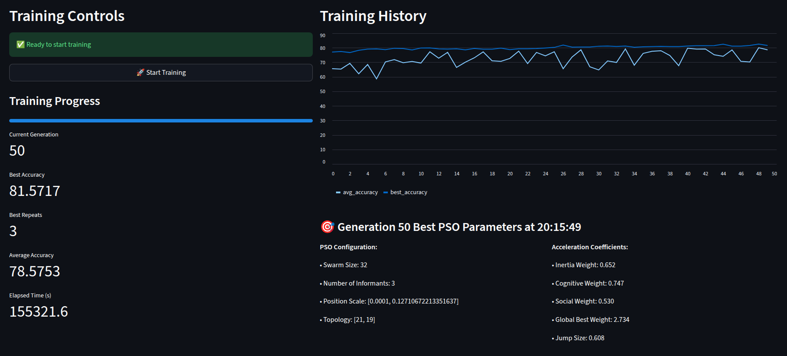

# W8 - Part 3 - Online Training and Visualisation

Table of Contents

- [1. Previously](#1-previously)
- [2. Online Training](#2-online-training)
  - [2.1 Streamlit Web Interface](#21-streamlit-web-interface)
  - [2.2 Train Manager](#22-train-manager)
  - [2.3 Database for Training Progress](#23-database-for-training-progress)
  - [2.4 The Web Interface](#24-the-web-interface)
- [3. Conclusion](#3-conclusion)
- [4. Next Steps](#4-next-steps)


## 1. Previously

We have a functionning neural network, with a working PSO algorithm and a Genetic Algorithm to search for the best hyperparameters to give to the PSO. We also added a function to get our accuracy metric.

Now that most of the implementation is done, we need to train a lot. In order to do so, we will implement an online training system, that will allow us to launch a training session 24/7 online and monitor the progress through a web interface. As we have never done this before and didn't learn it it class, but also this is far from the main focus of this project, we decided to keep it simple and use ChatGPT to help us with this part.

## 2. Online Training

### 2.1 Streamlit Web Interface

When gave a simple prompt to chatGPT, with what we wanted to do and see on the web interface. This is what we got:

```
import streamlit as st
import threading
import time
import random
import pandas as pd
from streamlit_autorefresh import st_autorefresh

from train_manager import TrainManager

st.set_page_config(page_title="AI Trainer Dashboard", layout="wide")

st.title("🤖 AI Training Dashboard")

# Initialize session state and manager
if "manager" not in st.session_state:
    st.session_state.manager = TrainManager()

manager = st.session_state.manager

# Create two main columns for dashboard layout
dashboard_left, dashboard_right = st.columns([1, 1.5])  # Right column slightly wider for chart

with dashboard_left:
    # Sidebar for training controls moved to left column
    st.header("Training Controls")
    
    if not manager.is_training():
        st.success("✅ Ready to start training")
        if st.button("🚀 Start Training", use_container_width=True):
            manager.start_training()
    else:
        st.warning("⏳ Training is running...")
        if st.button("🛑 Stop Training", use_container_width=True):
            manager.stop_training()

    # Progress and metrics
    progress = manager.get_progress()
    st.subheader("Training Progress")
    st.progress(progress["percent"])
    st.metric("Current Generation", progress["epoch"])
    st.metric("Best Accuracy", f"{progress['best_fitness']:.4f}")
    st.metric("Best Repeats", progress["best_repeats"])
    st.metric("Average Accuracy", f"{progress['avg_fitness']:.4f}")
    st.metric("Elapsed Time (s)", f"{progress['elapsed_time']:.1f}")

with dashboard_right:
    # Chart area
    st.header("Training History")
    chart_placeholder = st.empty()
    
    if "ga_history" in progress and not progress["ga_history"].empty:
        df = progress["ga_history"].copy()
        chart_placeholder.line_chart(
            data=df,
            y=['best_accuracy', 'avg_accuracy'],
            height=400  # Fixed height for stability
        )
        
        # Show best hyperparameters
        best_genome = progress.get("best_genome")
        if best_genome:
            timestamp = progress.get("best_genome_timestamp", 0)
            generation = progress["epoch"]
            st.subheader(f"🎯 Generation {generation} Best PSO Parameters at {time.strftime('%H:%M:%S', time.localtime(timestamp))}")
            col1, col2 = st.columns(2)
            with col1:
                st.write("**PSO Configuration:**")
                st.write(f"• Swarm Size: {best_genome['swarm_size']}")
                st.write(f"• Number of Informants: {best_genome['num_informants']}")
                st.write(f"• Position Scale: {best_genome['particle_initial_position_scale']}")
                st.write(f"• Topology: {best_genome['ann_layers']}")
            
            with col2:
                st.write("**Acceleration Coefficients:**")
                accel = best_genome['accel']
                st.write(f"• Inertia Weight: {accel['inertia_weight']:.3f}")
                st.write(f"• Cognitive Weight: {accel['cognitive_weight']:.3f}")
                st.write(f"• Social Weight: {accel['social_weight']:.3f}")
                st.write(f"• Global Best Weight: {accel['global_best_weight']:.3f}")
                st.write(f"• Jump Size: {accel['jump_size']:.3f}")
    else:
        chart_placeholder.info("Waiting for training data...")

# Reduce refresh rate to prevent flickering
st_autorefresh(interval=3000, key="training_refresh")
```

This code uses the Streamlit library to create a simple web interface that allows us to start and stop the training process, monitor its progress, and visualize training metrics over time. It uses a `TrainManager` class to handle the training logic, which we implemented separately.

It shows the current generation, best accuracy, average accuracy, and elapsed time. It also displays a line chart of the best and average accuracy over generations, updating every 3 seconds. More importantly, it shows the best PSO hyperparameters found so far. This allows us to monitor the training process in real-time and see how the PSO parameters evolve but also to copy them and use them directly in our experiments.

### 2.2 Train Manager

```
class TrainManager:
    def __init__(self):
        self._lock = threading.Lock()
        self._training_thread = None
        self._stop_flag = False
        self._best_genome = None
        self._initialize_ga()

    def _initialize_ga(self):
        (train_features, train_targets), (test_features, test_targets) = load_data(path="../../data/concrete_data.csv")
        input_size = train_features.shape[1]
        self.evaluator_config = dict(
            X=train_features.T,
            Y=train_targets,
            X_test=test_features.T,
            Y_test=test_targets,
            base_model_builder=partial(build_base_model, input_size=input_size),
            loss_function=mean_squared_error,
            max_train_seconds=90.0,
            num_genome_repeats_per_iteration=3,
            max_repeats_per_genome=21,
            explosion_factor=100,
            accuracy_checks_every=20,
            patience_window=10,
            verbose=False
        )

        self.optimizer = GeneticPsoOptimizer(
            evaluator_config=self.evaluator_config,
            population_size=12,
            generations=100,
            mutation_rate=0.2,
            crossover_rate=0.6,
            elitism=2,
            tournament_k=3,
            parallel=False
        )

    def _train_loop(self):
        start_time = time.time()
        progress = load_progress()
        
        def seed_genome_factory():
            return PsoGenome(
                swarm_size=random.randint(10, 50),
                accel=AccelerationCoefficientsGenome(
                    inertia_weight=random.uniform(0.4, 0.9),
                    cognitive_weight=random.uniform(1.0, 3.0),
                    social_weight=random.uniform(0.5, 2.0),
                    global_best_weight=random.uniform(0.1, 1.0),
                    jump_size=random.uniform(0.01, 1.0),
                    max_velocity=random.uniform(0.001, 1.0),
                    max_position=random.uniform(0.1, 10.0)
                ),
                num_informants=random.randint(1, 5),
                particle_initial_position_scale=(random.uniform(0.0001, 0.1), random.uniform(0.0001, 0.1)),
                ann_layers=[32, 16]
            )

        self.optimizer.initialize(seed_genome_factory)
        
        for gen in range(self.optimizer.generations):
            if self._stop_flag:
                break
                
            self.optimizer.evaluate_population()
            best_ind = max(self.optimizer.population, key=lambda ind: ind.accuracy)
            self._best_genome = best_ind.genome  # Store best genome
            avg_fitness = sum(ind.accuracy for ind in self.optimizer.population) / len(self.optimizer.population)

            with self._lock:
                progress["epoch"] = gen + 1
                progress["percent"] = int(((gen + 1) / self.optimizer.generations) * 100)
                progress["best_fitness"] = best_ind.accuracy
                progress["best_repeats"] = best_ind.accuracy_counts
                progress["avg_fitness"] = avg_fitness
                progress["elapsed_time"] = time.time() - start_time
                progress["best_genome"] = best_ind.genome
                progress["best_genome_timestamp"] = time.time()

                # Create new history DataFrame
                new_history = pd.DataFrame({
                    "best_accuracy": [best_ind.accuracy],
                    "avg_accuracy": [avg_fitness]
                })
                
                if "ga_history" not in progress or progress["ga_history"].empty:
                    progress["ga_history"] = new_history
                else:
                    progress["ga_history"] = pd.concat(
                        [progress["ga_history"], new_history],
                        ignore_index=True
                    ).reset_index(drop=True)
                
                save_progress(progress)
            
            self.optimizer.step()

        self._training_thread = None
        self._stop_flag = False

    def reset_progress(self):
        """Reset training progress to initial state."""
        initial_progress = {
            "epoch": 0,
            "percent": 0,
            "best_fitness": 0,
            "best_repeats": 0,
            "avg_fitness": 0,
            "elapsed_time": 0,
            "ga_history": pd.DataFrame({
                "best_accuracy": [],
                "avg_accuracy": []
            }),
            "loss_history": pd.DataFrame({"loss": []})
        }
        save_progress(initial_progress)

    def start_training(self):
        if not self.is_training():
            self.reset_progress()  # Reset progress before starting new training
            self._stop_flag = False
            self._training_thread = threading.Thread(target=self._train_loop, daemon=True)
            self._training_thread.start()

    def stop_training(self):
        if self.is_training():
            self._stop_flag = True
            self._training_thread.join(timeout=1)  # Wait for thread to finish
            self._training_thread = None
            self.reset_progress()  # Reset progress after stopping
            try:
                import multiprocessing as mp
                mp.active_children()
                for p in mp.active_children():
                    p.terminate()
            except Exception:
                pass

    def is_training(self):
        return self._training_thread is not None and self._training_thread.is_alive()

    def get_progress(self):
        return load_progress()

    def get_best_genome(self):
        """Returns the best genome found during training"""
        progress = load_progress()
        return progress.get("best_genome")
```

Here we have the `TrainManager` class that handles the training logic. It initializes the Genetic PSO optimizer, runs the training loop in a separate thread, and provides methods to start, stop, and check the training status. It also manages the training progress and saves it for the web interface to display.

### 2.3 Database for Training Progress

To save and load the training progress, we use yet another code which serves as a database for our training session:

```
# db.py
from sqlalchemy import create_engine, Column, Integer, Float, String, JSON
from sqlalchemy.ext.declarative import declarative_base
from sqlalchemy.orm import sessionmaker
import pandas as pd
import json
from io import StringIO
import os
import time

Base = declarative_base()

class TrainingProgress(Base):
    __tablename__ = "training_progress"
    id = Column(Integer, primary_key=True)
    epoch = Column(Integer, default=0)
    percent = Column(Integer, default=0)
    best_fitness = Column(Float, default=1.0)
    best_repeats = Column(Integer, default=0)
    avg_fitness = Column(Float, default=0.0)
    elapsed_time = Column(Float, default=0.0)
    loss_history = Column(String, default="[]")  # store as JSON string
    ga_history = Column(String, default="[]")  # store GA history as JSON
    best_genome = Column(String, default="{}")  # store genome as JSON
    best_genome_timestamp = Column(Float, default=0.0)  # store timestamp when best genome was found

# SQLite engine
engine = create_engine("sqlite:///training.db", connect_args={"check_same_thread": False})
SessionLocal = sessionmaker(bind=engine)

def recreate_database():
    """Drop all tables and recreate them"""
    if os.path.exists("training.db"):
        os.remove("training.db")
    Base.metadata.drop_all(bind=engine)
    Base.metadata.create_all(bind=engine)

# Recreate database with new schema
recreate_database()

# Helpers
def save_progress(progress):
    session = SessionLocal()
    record = session.query(TrainingProgress).first()
    if not record:
        record = TrainingProgress()
    record.epoch = progress["epoch"]
    record.percent = progress["percent"]
    record.best_fitness = progress["best_fitness"]
    record.best_repeats = progress["best_repeats"]
    record.avg_fitness = progress["avg_fitness"]
    record.elapsed_time = progress["elapsed_time"]
    # convert DataFrames to JSON
    record.loss_history = progress["loss_history"].to_json(orient="records")
    if "ga_history" in progress:
        record.ga_history = progress["ga_history"].to_json(orient="records")
    if "best_genome" in progress and progress["best_genome"]:
        genome = progress["best_genome"]
        print(genome)
        record.best_genome = json.dumps({
            "swarm_size": genome.swarm_size,
            "num_informants": genome.num_informants,
            "ann_layers": genome.ann_layers,
            "particle_initial_position_scale": genome.particle_initial_position_scale,
            "accel": {
                "inertia_weight": genome.accel.inertia_weight,
                "cognitive_weight": genome.accel.cognitive_weight,
                "social_weight": genome.accel.social_weight,
                "global_best_weight": genome.accel.global_best_weight,
                "jump_size": genome.accel.jump_size
            }
        })
        record.best_genome_timestamp = progress.get("best_genome_timestamp", time.time())
    session.add(record)
    session.commit()
    session.close()

def load_progress():
    session = SessionLocal()
    record = session.query(TrainingProgress).first()
    if record:
        progress = {
            "epoch": record.epoch,
            "percent": record.percent,
            "best_fitness": record.best_fitness,
            "best_repeats": record.best_repeats,
            "avg_fitness": record.avg_fitness,
            "elapsed_time": record.elapsed_time,
            "loss_history": pd.read_json(StringIO(record.loss_history)) if record.loss_history else pd.DataFrame({"loss":[]}),
            "ga_history": pd.read_json(StringIO(record.ga_history)) if record.ga_history else pd.DataFrame({"best_accuracy":[], "avg_accuracy":[]}),
            "best_genome": json.loads(record.best_genome) if record.best_genome != "{}" else None,
            "best_genome_timestamp": record.best_genome_timestamp
        }
    else:
        progress = {
            "epoch": 0,
            "percent": 0,
            "best_fitness": 1.0,
            "best_repeats": 0,
            "avg_fitness": 0.0,
            "elapsed_time": 0,
            "loss_history": pd.DataFrame({"loss":[]}),
            "ga_history": pd.DataFrame({"best_accuracy":[], "avg_accuracy":[]}),
            "best_genome": None,
            "best_genome_timestamp": 0.0
        }
    session.close()
    return progress
```

This code uses SQLAlchemy to create a SQLite database that stores the training progress. It defines a `TrainingProgress` model with fields for epoch, percent complete, best fitness, average fitness, elapsed time, loss history, GA history, best genome, and timestamp of the best genome. It also provides helper functions to save and load the training progress from the database.

### 2.4 The Web Interface



The Web Interface is really simple and straightforward but gives us all the information we need to monitor the training process. We can see the current generation, best accuracy, average accuracy, and elapsed time. The line chart shows how the best and average accuracy evolve over generations. The best PSO hyperparameters found so far are displayed on the right side, allowing us to copy them easily for our experiments.

## 3. Conclusion

In this part, we implemented an online training system using Streamlit for the web interface and SQLAlchemy for storing the training progress in a SQLite database. This setup allows us to run long training sessions and monitor their progress in real-time, making it easier to track the performance of our Genetic PSO optimizer and the neural network training process. The ability to see the best PSO hyperparameters found during training is particularly useful for our experiments.

## 4. Next Steps

Now we will have time to look at the results of our training sessions, analyze the best PSO hyperparameters found, and run experiments to see how well they perform compared to manually tuned parameters. We can also consider further improvements to the training process or the web interface based on our experience with this setup.

